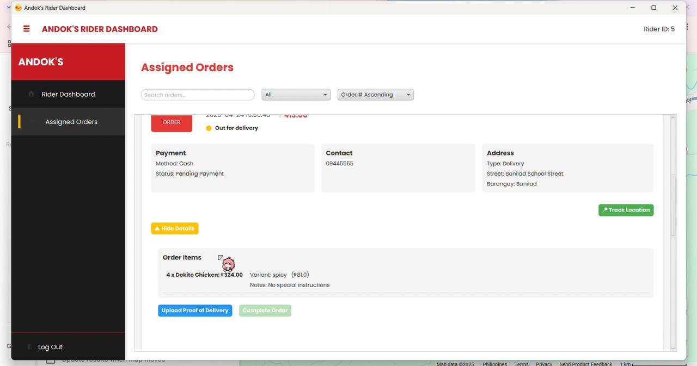
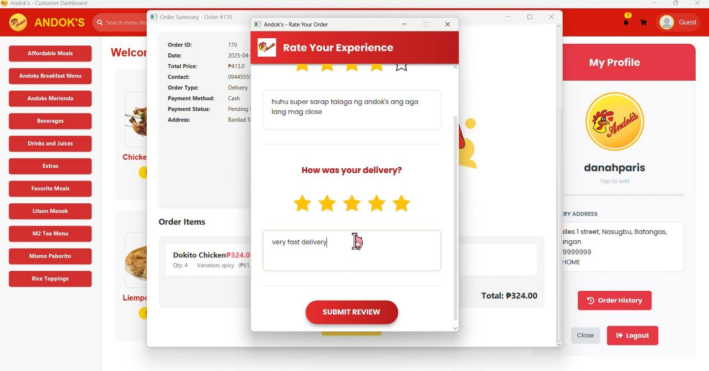

# 🍗 Andok’s Food Ordering System

A full-featured desktop food ordering and delivery system built using JavaFX, tailored for Andok’s, a local restaurant business. This system supports **admin, rider, and customer** roles with dashboards, real-time order tracking, email notifications, analytics, and more.

## 🧠 Overview

The Andok’s Food Ordering System streamlines the process from customer ordering to rider delivery. It supports:

- Order browsing and customization
- Role-based login (Admin, Rider, Customer)
- Real-time order status updates
- Payment via Cash, Card, or GCash
- Admin analytics and PDF report generation
- Audit trails and notification system

---

## 🎯 Objectives

- Provide a user-friendly online food ordering experience
- Enable admins to manage orders, menus, and rider accounts
- Automate delivery assignment and order tracking
- Enhance customer satisfaction through timely service
- Generate real-time reports for business insights

---

## 🛠️ Tech Stack

- **JavaFX** – UI/UX
- **JavaMail (javax.mail)** – Email notifications
- **iText PDF** – Report generation
- **MySQL** – Database
- **SHA-256 Hashing** – Password security
- **Java OOP + JDBC** – Logic and data layer

---

## 🗂️ System Features

### 🔐 Role-Based Access

- **Admin**
  - Dashboard with store stats and controls
  - Menu & rider management
  - Assign delivery orders
  - Approve/decline GCash payments
  - Real-time audit logs
  - Generate PDF reports

- **Customer**
  - Browse and customize menu
  - Role-based login/signup
  - Cart, checkout (delivery or pickup)
  - Upload proof for GCash
  - Track order status
  - Rate completed orders

- **Rider**
  - View assigned orders
  - Upload proof of delivery
  - Track ratings and performance
  - Update delivery statuses

### 📦 Delivery & Pickup Modes

- **Delivery**
  - Nasugbu-area only
  - Fee based on distance
  - Pay via Cash, GCash, or Card

- **Pickup**
  - Card or GCash only
  - Time slot selection (past slots excluded)

---

## 🧾 Data & Functionality Highlights

- **Stored Procedures** – For frequent actions (get user info, send notif)
- **Views** – For rider earnings, order summary, analytics
- **Triggers** – Track changes in orders and logs
- **Audit Trail** – Monitors admin, rider, and customer actions
- **Events** – Auto-clean old logs and trigger product alerts
- **CRUD Operations** – On menu, user, orders, riders

---

## 📸 Screenshots

## 📊 ERD & System Flow

## 🧪 How to Run
- Clone this repository
- Import into NetBeans or IntelliJ
- Set up MySQL database using provided .sql file
- Configure DB connection in DBConnection.java
- Run Main.java

## 📬 Contact & Credits

Developed as a finals project by **Danah Paris**

📧 Email: micadanah21@gmail.com

📌 School: [BatStateU - ARASOF Nasugbu] | Course: [BSIT]

## 📄 License
This project was built for educational purposes.
Feel free to explore and learn, but please credit when using this project.
